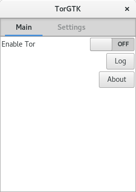

# TorGTK

TorGTK is a frontend for Tor written in Python and GTK 3. 

## What has been done
 * Logo
 * UI via Glade
 * About box
 * Turning Tor on and off
 * SOCKS port selection
 * Log file viewing

## What needs to be done
 * Logo
 * Advanced Tor settings (eg. exit from specific country, specific node, etc.)
 * More polish on documentation, README.md, etc.
 * Automatic log file refreshing

## Requirments
 * A local copy of [Tor](http://www.torproject.org/) on your computer
 * Python 2 (Python 3 does not work currently)
 * [Stem](https://stem.torproject.org/)
 * [GTK 3](http://www.gtk.org/) and [PyGObject](https://wiki.gnome.org/action/show/Projects/PyGObject?action=show&redirect=PyGObject)

TorGTK has been tested on FreeBSD 10.2, Ubuntu GNOME 15.10, and Debian Testing.

# Getting Started

Assuming if you have GTK 3, PyGObject, and Stem installed, you can clone TorGTK
and (even run it) with these following commands:

	$ git clone https://github.com/neelchauhan/TorGTK.git
	$ cd TorGTK/TorGTK
	$ ./main.py

You can also use setup.py to install it into your OS prefix (eg. /usr or
/usr/local).

## License
TorGTK is licensed under the Simplified BSD license.

## Author
TorGTK is authored by Neel Chauhan.
