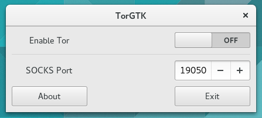

# TorGTK

TorGTK is a frontend for Tor written in Python and GTK 3. 

## What has been done
 * UI via Glade
 * About box
 * Turning Tor on and off
 * SOCKS port selection

## What needs to be done
 * Logo
 * Advanced Tor settings (eg. exit from specific country, specific node, etc.)
 * More polish on documentation, README.md, etc.

## Requirments
 * Python 2 (Python 3 does not work currently)
 * [Stem](https://stem.torproject.org/)
 * [GTK 3](http://www.gtk.org/) with Python bindings

TorGTK has been tested on FreeBSD 10.2 and Ubuntu GNOME 15.10.

## License
TorGTK is licensed under the Simplified BSD license.

## Author
TorGTK is authored by Neel Chauhan.
